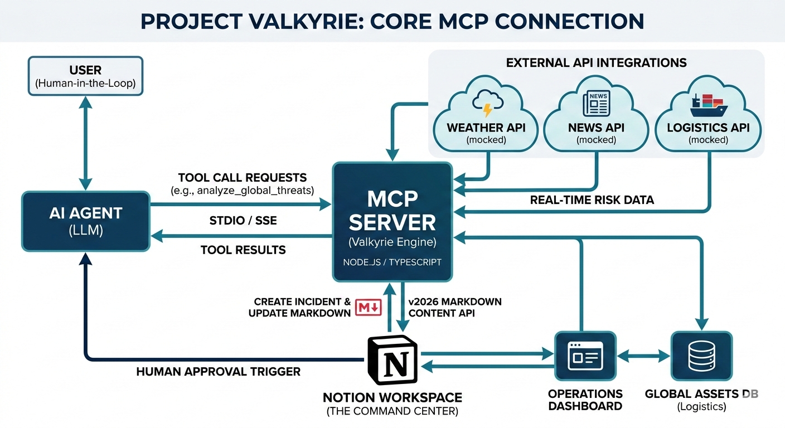
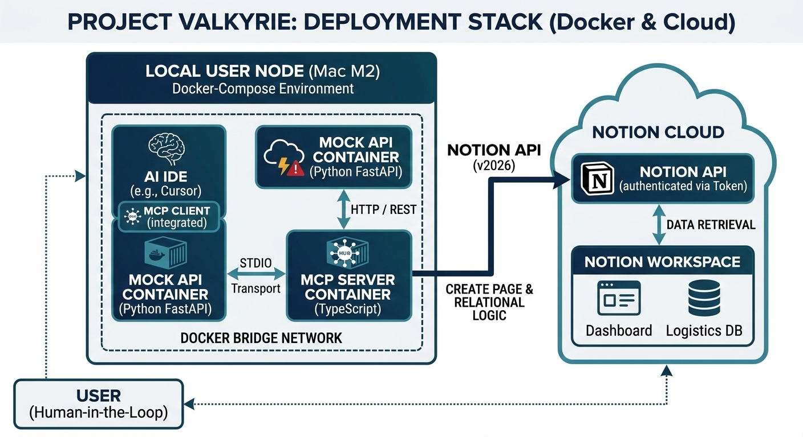
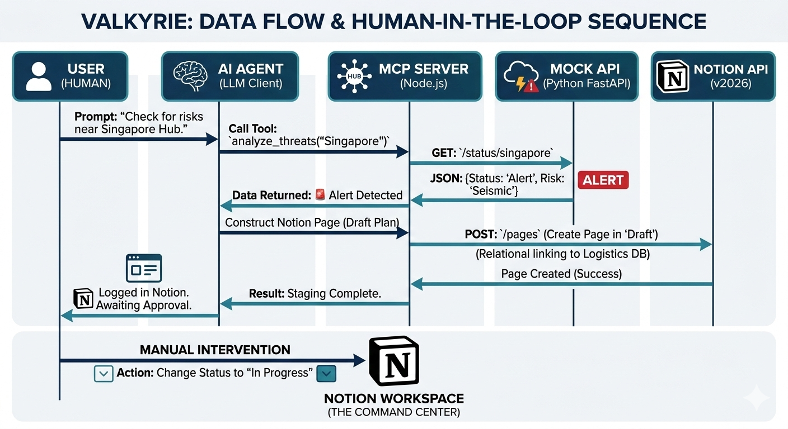

# 🛰️ Project Valkyrie: AI-Powered Crisis Logistics

**The Model Context Protocol (MCP) Command Center for Global Infrastructure**

---

## 🌪️ The Problem

In modern logistics, **"latency kills."** When a natural disaster or geopolitical event occurs, information is scattered across news feeds, weather maps, and internal databases. Operators lose precious minutes switching between tabs, trying to piece together a complete picture of the crisis.

**Context-switching fatigue costs millions in delayed response times.**

---

## 🛡️ The Valkyrie Solution

Valkyrie uses the **Model Context Protocol (MCP)** to turn Notion into a living, breathing Command Center. It bridges real-time external "Threat Data" with internal "Asset Data," allowing an AI Agent to autonomously stage response plans for human approval.

### Key Features

| Feature                          | Description                                                                     |
| -------------------------------- | ------------------------------------------------------------------------------- |
| **Autonomous Threat Monitoring** | Periodically scans global feeds for risks near assets listed in Notion          |
| **Instant Incident Staging**     | Automatically generates Notion pages with threat analysis and proposed response |
| **Relational Integrity**         | Links incidents to affected assets using Notion's relation properties           |
| **Human-in-the-Loop**            | AI proposes solutions; humans approve and execute                               |

---

## 🛠️ Technical Implementation

### Architecture


_High-Level Core MCP Connection - The MCP Server as the Intelligence Hub_

```
┌─────────────────┐     ┌─────────────────┐     ┌─────────────────┐
│   Python Mock   │────▶│   MCP Server    │────▶│     Notion      │
│   Threat API    │     │   (TypeScript)  │     │   Workspace     │
└─────────────────┘     └─────────────────┘     └─────────────────┘
       ▲                        │                       │
       │                        ▼                       ▼
   Simulated            AI Agent (IDE)           Operations Dashboard
   Crisis Data          via MCP Client           & Logistics DB
```

### Deployment Stack


_Technical Component Stack - Docker containers for MCP Server and Mock API_

### Tech Stack

- **MCP Server**: TypeScript with `@modelcontextprotocol/sdk`
- **Notion API**: v2022-06-28 with block children for rich content
- **Threat Simulator**: Python FastAPI for realistic demo scenarios
- **Deployment**: Docker Compose + GitHub Actions CI/CD

### MCP Tools Exposed

| Tool                      | Description                                                  |
| ------------------------- | ------------------------------------------------------------ |
| `analyze_global_threats`  | Check specific asset for threats, stage incident if detected |
| `scan_all_assets`         | Scan all assets in Logistics database for threats            |
| `get_asset_details`       | Retrieve full details of a specific asset                    |
| `list_all_assets`         | List all tracked assets with risk levels                     |
| `find_nearest_safe_asset` | Find nearest stable asset for rerouting                      |

---

## 🚀 Quick Start

### Prerequisites

- Node.js 20+
- Python 3.11+
- Notion account with integration access

### 1. Clone & Install

```bash
git clone https://github.com/kanyingidickson-dev/valkyrie-mcp-server.git
cd valkyrie-mcp-server
npm install
```

### 2. Configure Notion

1. Go to [Notion Integrations](https://www.notion.so/my-integrations)
2. Create a new integration called "Valkyrie Engine"
3. Copy the integration token

### 3. Create Notion Databases

**Operations Dashboard Database:**
| Property | Type |
|----------|------|
| Incident Name | Title |
| Status | Status (Draft, Awaiting Approval, In Progress, Resolved) |
| Threat Level | Select (Critical (Red), Elevated (Yellow), Stable (Green)) |
| Affected Assets | Relation → Logistics DB |
| AI Assessments | Rich Text |

**Global Assets & Logistics Database:**
| Property | Type |
|----------|------|
| Asset Name | Title |
| Coordinates | Text |
| Risk Sensitivity | Number (1-10) |
| Status | Select (Active, Inactive, Maintenance) |
| Facility Type | Select (Distribution Hub, Transport Node, Data Center) |
| Primary Contact | Text |
| Primary Phone | Phone |
| Primary Email | Email |
| Facility Manager | Text |
| Last Audit | Date |

### 4. Share Databases with Integration

On each database: Click `...` → Add connections → Select "Valkyrie Engine"

### 5. Configure Environment

```bash
cp .env.example .env
# Edit .env with your Notion token and database IDs
```

Ensure the following env vars are set in your `.env` (examples in `.env.example`):

- `NOTION_TOKEN`, `DASHBOARD_DB_ID`, `LOGISTICS_DB_ID`
- `MOCK_API_URL` (development)
- `WEBHOOK_PORT`, `WEBHOOK_ACTION_TOKEN` (webhook security)
- Optional notifications: `SLACK_WEBHOOK_URL`, `SLACK_SIGNING_SECRET`, `EMAIL_SMTP_*`, `ALERT_RECIPIENT`

### Additional runtime scripts

The repository includes auxiliary scripts for local testing and orchestration:

- Start the webhook server (handles Slack interactive actions and link buttons):

```bash
npm run start:webhook
```

- Start the Notion watcher (polls the Operations Dashboard for status changes):

```bash
npm run start:watcher
```

- Start the scheduler (periodic `scan_and_stage` runs):

```bash
npm run start:scheduler
```

Notifications will only be sent if `SLACK_WEBHOOK_URL` and/or SMTP env vars are configured. The webhook action token must be set to enable secure action links.

### 6. Seed Assets

```bash
pip install -r scripts/requirements.txt
python scripts/seed_assets.py
```

### 7. Run the Mock API

```bash
pip install -r mock-api/requirements.txt
python mock-api/valkyrie_mock_api.py
```

### 8. Build & Run MCP Server

```bash
npm run build
npm start
```

### 9. Configure MCP Client

Add to your MCP client settings (Windsurf, Cursor, etc.):

```json
{
  "mcpServers": {
    "valkyrie": {
      "command": "node",
      "args": ["/path/to/valkyrie-mcp-server/dist/index.js"],
      "env": {
        "NOTION_TOKEN": "secret_xxx",
        "DASHBOARD_DB_ID": "xxx",
        "LOGISTICS_DB_ID": "xxx"
      }
    }
  }
}
```

---

## 🎬 Demo Workflow


_Data Flow & Human-in-the-Loop Sequence - From threat detection to human approval_

1. **Detection**: Ask AI: _"Valkyrie, check for threats near our Singapore Hub"_
2. **Autonomous Action**: AI fetches threat data via MCP, identifies seismic event
3. **Staging**: AI creates Notion page with status "Awaiting Approval"
4. **Human Intervention**: Operator reviews, changes status to "In Progress"
5. **Execution**: Crisis Response Playbook is triggered

---

## Verification Commands

```bash
# Run each command on its own line
npm test
npm run lint
npm run format
npm run type-check
npm run build
npm start
```

---

## 📊 Architecture Diagrams

| Diagram                                               | Description                         |
| ----------------------------------------------------- | ----------------------------------- |
| [Logical Overview](./docs/logical-overview.png)       | MCP Server as the Intelligence Hub  |
| [Deployment Overview](./docs/deployment-overview.png) | Docker containers & technical stack |
| [Demo Workflow](./docs/demo-workflow.png)             | Human-in-the-loop sequence          |

---

## 🧪 Testing

### Run Mock API Tests

```bash
# Health check
curl http://localhost:8000/health

# Check specific location
curl http://localhost:8000/status/Singapore%20Hub

# Force a threat (for demo)
curl http://localhost:8000/trigger/Singapore%20Hub

# Batch scan
curl http://localhost:8000/batch/scan
```

### Docker Deployment

```bash
docker-compose up -d
docker-compose logs -f
```

---

## 📁 Project Structure

```
valkyrie-mcp-server/
├── src/                              # MCP server source code
│   ├── index.ts                      # MCP server entry point
│   ├── config.ts                     # Configuration management
│   ├── lib/                          # Core libraries
│   │   ├── assets.ts                 # Asset data utilities
│   │   └── assets.d.ts               # Type definitions
│   ├── tools/                        # MCP tool implementations
│   │   ├── index.ts                  # Tool exports
│   │   ├── analyze-threats.ts        # analyze_global_threats tool
│   │   ├── scan-assets.ts            # scan_all_assets tool
│   │   ├── get-asset-details.ts      # get_asset_details tool
│   │   ├── list-assets.ts            # list_all_assets tool
│   │   └── find-nearest-safe.ts      # find_nearest_safe_asset tool
│   └── types/                        # Type definitions
├── mock-api/                         # Threat simulator API
│   ├── valkyrie_mock_api.py          # FastAPI threat simulator
│   ├── requirements.txt
│   └── Dockerfile
├── scripts/                          # Orchestration & utility scripts
│   ├── seed_assets.py                # Populate Notion logistics DB
│   ├── clean_duplicates.py           # Remove duplicate assets
│   ├── scan_and_stage.js             # Scan assets and stage incidents
│   ├── trigger_and_stage.js          # Trigger threats and stage incidents
│   ├── notion_watcher.js             # Poll Notion for status changes
│   ├── webhook_server.js             # Handle Slack actions
│   ├── scheduler.js                  # Periodic scan scheduler
│   ├── notify.js                     # Notification utilities
│   └── requirements.txt
├── tests/                            # Test files
├── docs/                             # Documentation assets
│   ├── logical-overview.png
│   ├── deployment-overview.png
│   └── demo-workflow.png
├── .github/                          # CI/CD workflows
│   └── workflows/
│       └── valkyrie-deploy.yml
├── .data/                            # Local data storage
├── .husky/                           # Git hooks
├── dist/                             # Compiled output
├── package.json                      # Dependencies & scripts
├── tsconfig.json                     # TypeScript config
├── jest.config.cjs                   # Jest test config
├── .eslintrc.json                    # ESLint config
├── .prettierrc                       # Prettier config
├── docker-compose.yml                # Docker orchestration
├── Dockerfile                        # MCP server container
├── .env.example                      # Environment template
├── MCP_INSTRUCTIONS.md               # MCP usage guide
├── LICENSE
└── README.md
```

---
