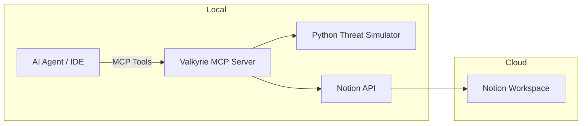
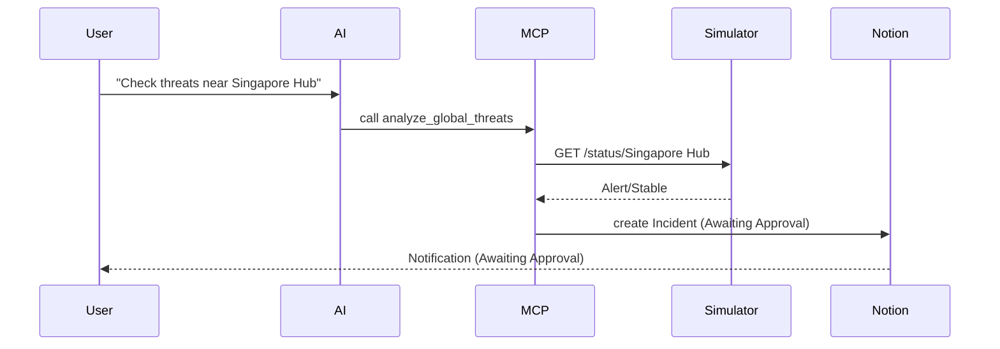

# Project Valkyrie Diagrams (Mermaid)

## 1. High-Level Core MCP Connection



## 2. Data Flow & Human-in-the-Loop Sequence



## 3. Technical Component Stack

```mermaid
graph TD
  A[Local Machine] --> B[Docker Compose]
  B --> C[Valkyrie MCP Container]
  B --> D[Python Threat Simulator Container]
  C --> E[Notion API (Cloud)]
  C --> F[AI IDE]
```

```

```
